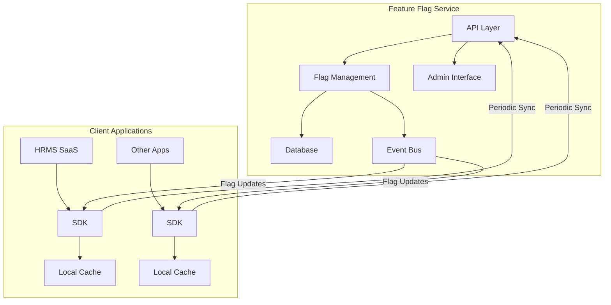

# Feature Flag Service

A high-performance, multi-tenant feature flag service built with NestJS, designed for sub-10ms evaluation times and enterprise-grade reliability.

## Features

- **High Performance**: Sub-10ms evaluation times through optimized caching and evaluation strategies
- **Multi-Tenant Support**: Isolated data and configuration per tenant
- **Real-time Updates**: WebSocket-based flag updates for instant propagation
- **Advanced Targeting**: Complex rule-based targeting with multiple conditions
- **Version Control**: Track and manage flag changes with versioning
- **Audit Trail**: Comprehensive audit logging for all flag changes
- **Self-hosted**: Deploy on your own infrastructure
- **Managed Service**: Optional cloud-hosted service (coming soon)

## Architecture



## Getting Started

### Prerequisites

- Node.js >= 18.0.0
- PostgreSQL >= 14
- Redis >= 7
- Docker (optional)

### Installation

1. Clone the repository:
   ```bash
   git clone https://github.com/your-org/feature-flag-service.git
   cd feature-flag-service
   ```

2. Install dependencies:
   ```bash
   yarn install
   ```

3. Set up environment variables:
   ```bash
   cp .env.example .env
   # Edit .env with your configuration
   ```

4. Start the development server:
   ```bash
   yarn workspace @feature-flag-service/server start:dev
   ```

### Docker Deployment

```bash
docker-compose up -d
```

## Project Structure

```
feature-flag-service/                # Main service repository
├── packages/
│   ├── server/                      # Backend service
│   │   ├── src/
│   │   │   ├── api/                 # API endpoints
│   │   │   ├── admin/               # Admin interface
│   │   │   ├── core/                # Core business logic
│   │   │   ├── db/                  # Database access
│   │   │   └── events/              # Event handling
│   │   └── package.json
│   ├── sdk-js/                      # JavaScript SDK
│   │   ├── src/
│   │   │   ├── core/                # Core evaluation logic
│   │   │   ├── cache/               # Local caching
│   │   │   └── api/                 # API client
│   │   └── package.json
│   ├── sdk-node/                    # Node.js SDK
│   ├── sdk-react/                   # React SDK
│   └── common/                      # Shared types and utilities
├── docker/                          # Docker configuration
├── k8s/                             # Kubernetes configuration
└── package.json                     # Root package.json for monorepo
```

## API Documentation

The API documentation is available at `/api/docs` when running the server.

## SDK Usage

### JavaScript/TypeScript

```typescript
import { FeatureFlagClient } from '@feature-flag-service/sdk-js';

const client = new FeatureFlagClient({
  apiUrl: 'https://your-feature-flag-service.com',
  apiKey: 'your-api-key',
});

// Initialize the client
await client.initialize();

// Evaluate a flag
const isEnabled = await client.getBooleanValue('my-feature', false);
```

### React

```typescript
import { FeatureFlagProvider, useFeatureFlag } from '@feature-flag-service/sdk-react';

function App() {
  return (
    <FeatureFlagProvider
      apiUrl="https://your-feature-flag-service.com"
      apiKey="your-api-key"
    >
      <MyApp />
    </FeatureFlagProvider>
  );
}

function MyFeature() {
  const isEnabled = useFeatureFlag('my-feature', false);
  
  return isEnabled ? <NewFeature /> : <OldFeature />;
}
```

## Contributing

1. Fork the repository
2. Create your feature branch (`git checkout -b feature/amazing-feature`)
3. Commit your changes (`git commit -m 'Add some amazing feature'`)
4. Push to the branch (`git push origin feature/amazing-feature`)
5. Open a Pull Request

## License

This project is licensed under the MIT License - see the [LICENSE](LICENSE) file for details. 