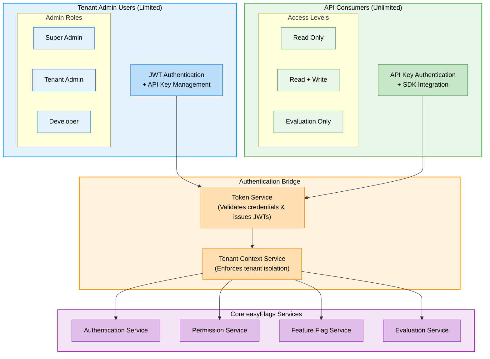

# Authentication Architecture

## Multi-Tenant Authentication System

easyFlags implements a sophisticated multi-tenant authentication architecture that supports both internal tenant users and external API consumers. This design ensures secure isolation between tenants while enabling flexible integration patterns.

## Authentication Flow

The diagram above illustrates the multi-tenant authentication architecture of easyFlags. Here's how the system handles authentication:

1. **Tenant Admin Users** authenticate using JWT-based authentication with username/password
2. **API Consumers** authenticate using API keys generated within their tenant context
3. The **Token Service** validates credentials and issues appropriate JWT tokens
4. The **Tenant Context Service** enforces tenant boundaries and prevents cross-tenant access
5. Core services enforce permissions based on the authenticated user's role and tenant

## Key Components

### Authentication Methods

- **JWT Authentication**: Used primarily for human users accessing the admin interface
- **API Key Authentication**: Used for machine-to-machine communication and SDK integration

### User Types and Roles

- **Tenant Administrators**:
  - Super Admin: Complete access to all tenant resources
  - Tenant Admin: Can manage users and flags within their tenant
  - Developer: Can create and modify flags but has limited administrative capabilities

- **API Consumers**:
  - Read Only: Can only view flags and their status
  - Read + Write: Can view and modify flags programmatically
  - Evaluation Only: Limited to flag evaluation operations

### Tenant Isolation

The system maintains strict tenant boundaries through:

1. **JWT Claims**: All tokens contain tenant identification
2. **Tenant Context Middleware**: Validates tenant access for every request
3. **Database Partitioning**: Each tenant's data is logically separated

### Permission Enforcement

The Permission Service implements:

1. Role-based access control
2. Fine-grained permissions (action:resource format)
3. Permission inheritance and delegation
4. Audit logging for security-relevant activities

## Integration Patterns

easyFlags supports multiple integration patterns for authentication:

1. **Direct Authentication**: Using the built-in JWT and API key mechanisms
2. **SSO Integration**: Support for SAML and OAuth2/OIDC providers
3. **Custom Auth Providers**: Extensible authentication modules for specialized needs

## Security Considerations

The authentication system implements several security best practices:

1. **Token Expiration**: Short-lived access tokens with refresh token capability
2. **Key Rotation**: Automated and manual API key rotation mechanisms
3. **Rate Limiting**: Protection against brute-force attacks
4. **Audit Trails**: Comprehensive logging of authentication events 