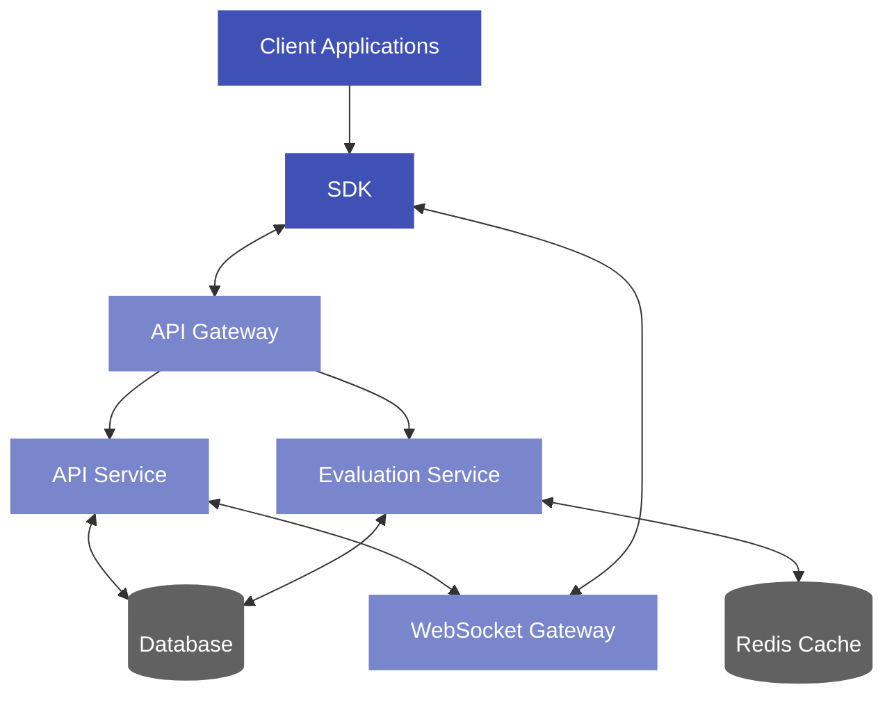
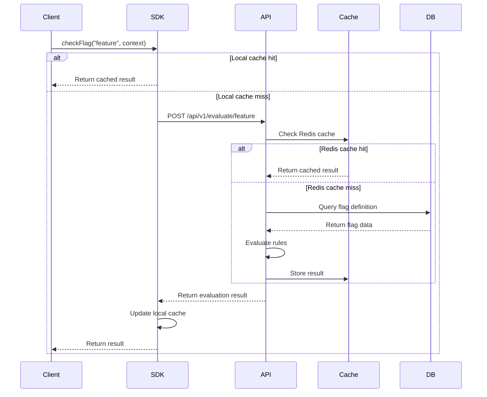
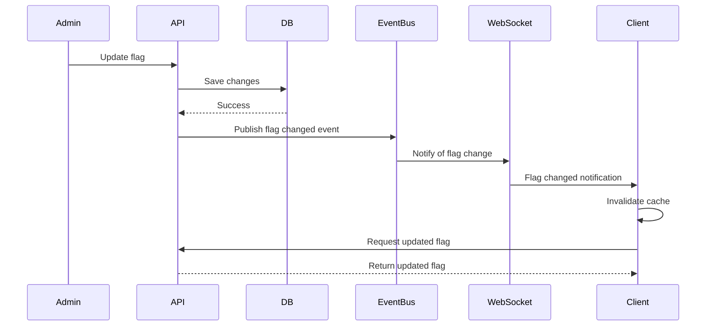
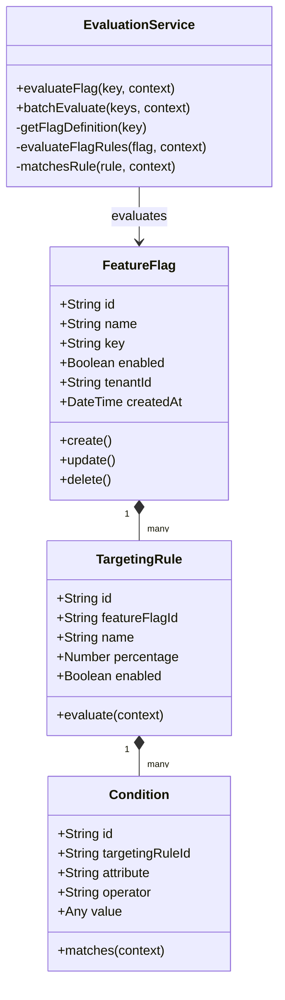
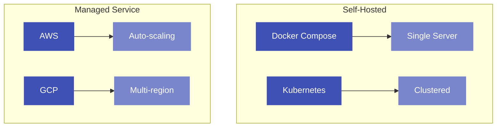

# Architecture Overview

easyFlags is designed as a high-performance, multi-tenant feature flag service with a focus on ultra-low latency evaluation. This page provides an overview of the system architecture and components.

## System Architecture

## Key Components

easyFlags consists of several key components, each with a specific role in the system:

### Client-Side Components

- **SDK**: Client libraries for different languages that provide feature flag evaluation, caching, and real-time updates
- **WebSocket Client**: Establishes persistent connection for real-time flag updates

### Server-Side Components

- **API Gateway**: Routes requests to appropriate services and handles authentication/authorization
- **API Service**: Manages feature flags, targeting rules, and other configuration data
- **Evaluation Service**: High-performance evaluation engine optimized for sub-10ms response times
- **WebSocket Gateway**: Provides real-time flag updates to connected clients
- **Redis Cache**: In-memory cache for flag definitions and evaluation results
- **Database**: Persistent storage for feature flags, targeting rules, and audit logs

## Data Flow

### Evaluation Flow

### Flag Update Flow

## Class Diagram

## Deployment Architecture

easyFlags can be deployed in various configurations depending on your requirements:

In the next sections, we'll dive deeper into each component of the architecture. 