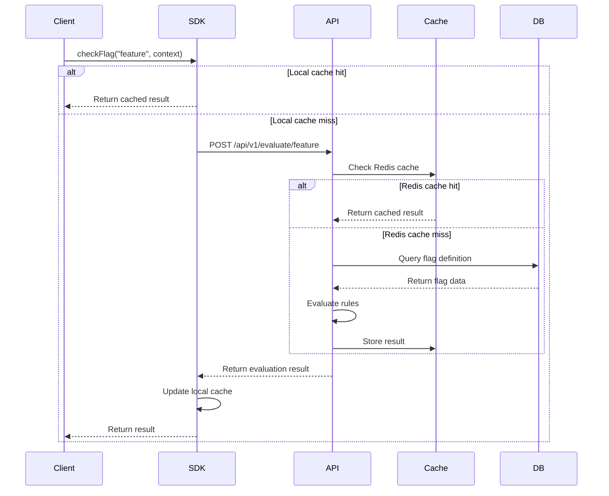
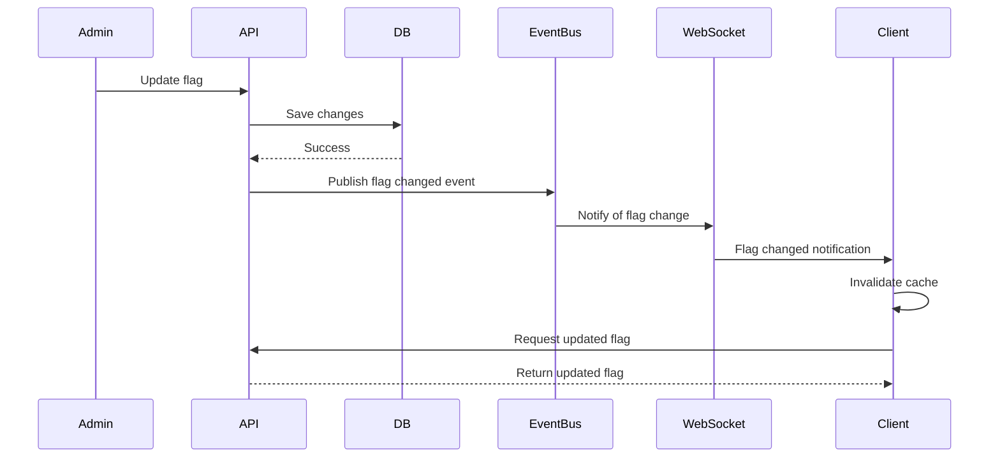
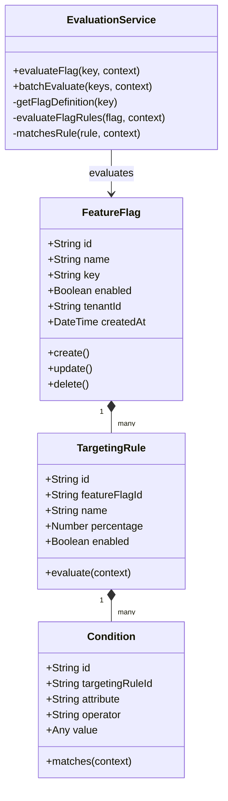
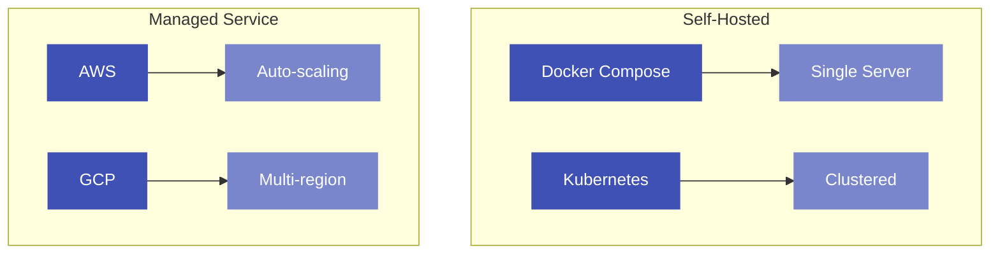

# Architecture Overview

easyFlags is designed as a high-performance, multi-tenant feature flag service with a focus on ultra-low latency evaluation. This page provides an overview of the system architecture and components.

## System Architecture

```mermaid
flowchart TB
    %% DEFINE STYLES - Clean minimal design
    classDef clientBox fill:#e3f2fd,stroke:#1565c0,stroke-width:1px,color:black,rx:0px
    classDef sdkBox fill:#bbdefb,stroke:#1976d2,stroke-width:1px,color:black,rx:0px
    classDef networkBox fill:#fff8e1,stroke:#ff8f00,stroke-width:1px,color:black,rx:0px
    classDef serviceBox fill:#e8f5e9,stroke:#2e7d32,stroke-width:1px,color:black,rx:0px
    classDef dataBox fill:#f3e5f5,stroke:#8e24aa,stroke-width:1px,color:black,rx:0px
    classDef monitorBox fill:#ffebee,stroke:#c2185b,stroke-width:1px,color:black,rx:0px

    %% CLIENT APPLICATIONS
    subgraph clientLayer["CLIENT APPLICATIONS"]
        direction LR
        MobileApp["Mobile Apps<br>(iOS/Android)"]
        WebApp["Web Admin UI<br>(React)"]
        ServerApp["Server Apps<br>(Node.js/Java/Python)"]
    end

    %% SDK INTEGRATION LAYER
    subgraph sdkLayer["SDK INTEGRATION LAYER"]
        direction LR
        subgraph BrowserSDKs["Browser SDKs"]
            JSsdk["JavaScript SDK"]
            ReactSDK["React SDK"]
        end
        
        subgraph ServerSDKs["Server SDKs"]
            NodeSDK["Node.js SDK"]
            PythonSDK["Python SDK"]
            JavaSDK["Java SDK"]
        end
        
        subgraph ClientCache["Client-Side Caching"]
            LocalCache["SDK Local Cache"]
        end
    end

    %% NETWORKING LAYER
    subgraph networkLayer["NETWORKING LAYER"]
        direction LR
        subgraph ApiGateways["API Gateways"]
            RestAPI["REST API Gateway"]
            WsAPI["WebSocket Gateway"]
        end
        
        LoadBalancer["Load Balancer"]
    end

    %% CORE SERVICES LAYER
    subgraph serviceLayer["CORE SERVICE LAYER"]
        direction LR
        subgraph FlagMgmt["Flag Management"]
            FlagService["Feature Flag Service"]
            RulesService["Targeting Rules Service"]
            VersionService["Flag Version Service"]
        end
        
        subgraph Auth["Authentication & Authorization"]
            AuthService["Auth Service"]
            PermService["Permission Service"]
        end
        
        subgraph Admin["Administration"]
            AdminService["Admin Service"]
            TenantService["Tenant Management"]
            AuditService["Audit Log Service"]
        end
        
        subgraph Eval["Flag Evaluation"]
            EvalService["High-Performance Evaluation Service"]
        end
    end

    %% DATA MANAGEMENT LAYER
    subgraph dataLayer["DATA MANAGEMENT LAYER"]
        direction LR
        subgraph Cache["High-Speed Caching"]
            RedisCache["Redis Cache<br>(Flag Definitions)"]
        end
        
        subgraph Storage["Persistent Storage"]
            PostgresDB["PostgreSQL<br>(Primary Database)"]
            TimeSeriesDB["Time-Series DB<br>(Analytics)"]
            AuditLogs["Audit Log Storage"]
        end
    end
    
    %% MONITORING LAYER
    subgraph monitorLayer["MONITORING & OPERATIONS"]
        direction LR
        Metrics["Metrics Collection<br>(Prometheus)"]
        Dashboards["Dashboards<br>(Grafana)"]
        Alerting["Alert System"]
        Logs["Centralized Logging"]
    end

    %% MAIN VERTICAL CONNECTIONS ONLY
    clientLayer --> sdkLayer
    sdkLayer --> networkLayer
    networkLayer --> serviceLayer
    serviceLayer --> dataLayer
    dataLayer --> monitorLayer

    %% STYLE APPLICATION
    clientLayer:::clientBox
    sdkLayer:::sdkBox
    networkLayer:::networkBox
    serviceLayer:::serviceBox
    dataLayer:::dataBox
    monitorLayer:::monitorBox
```

## Key Components

easyFlags consists of several key components, each with a specific role in the system:

### Client-Side Components

- **Web Admin UI**: Browser-based interface for managing feature flags and permissions
- **Mobile Apps**: Native mobile applications for on-the-go flag management
- **Server Applications**: Server-side applications consuming feature flags
- **SDK Libraries**: Client libraries for different languages (JavaScript, React, Node.js, Python, Java)
- **Local SDK Cache**: Client-side caching to minimize network requests and improve performance

### Infrastructure Components

- **Load Balancer**: Distributes traffic and ensures high availability
- **REST API Gateway**: Routes requests to appropriate services, handles authentication/authorization
- **WebSocket Gateway**: Provides real-time flag updates to connected clients

### Core Services

- **Auth Service**: Manages user authentication, JWT tokens, and API keys
- **Permission Service**: Implements role-based access control and fine-grained permissions
- **Feature Flag Service**: Handles CRUD operations for feature flags
- **Targeting Rules Service**: Manages targeting rules and conditions
- **Flag Version Service**: Manages flag versioning and rollback capabilities
- **Evaluation Service**: High-performance engine optimized for sub-10ms response times
- **Admin Service**: Provides administrative functions and user management
- **Tenant Service**: Manages multi-tenant boundaries and isolation
- **Audit Log Service**: Records all system activities for compliance and debugging

### Data Storage

- **Redis Cache**: In-memory cache for flag definitions and evaluation results
- **PostgreSQL Database**: Persistent storage for feature flags, rules, users, and configuration
- **Analytics Database**: Time-series storage for metrics and usage analytics
- **Audit Log Storage**: Specialized storage for security and compliance audit trails

### Monitoring & Operations

- **Metrics Collection**: Collects system metrics using Prometheus
- **Dashboards**: Visualizes metrics and performance using Grafana
- **Alert System**: Proactive notification for system issues and anomalies
- **Centralized Logging**: Aggregates logs from all system components

## Data Flow

### Evaluation Flow

### Flag Update Flow

## Class Diagram

## Deployment Architecture

easyFlags can be deployed in various configurations depending on your requirements:

In the next sections, we'll dive deeper into each component of the architecture. 