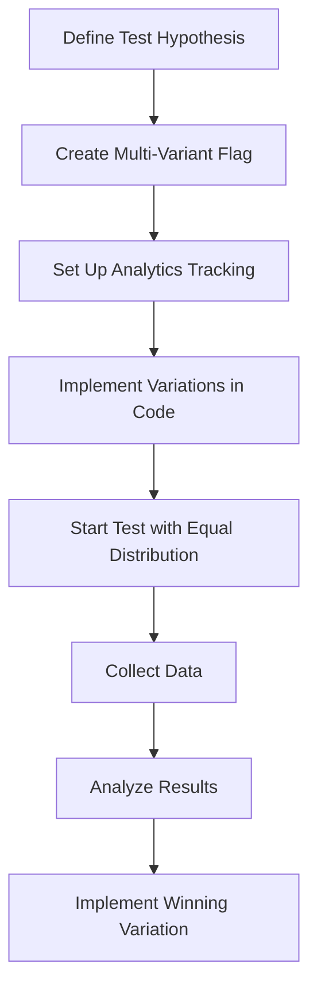

# A/B Testing

A/B testing (also known as split testing) is a powerful technique for comparing two or more versions of a feature to determine which one performs better. easyFlags provides the infrastructure needed to implement effective A/B tests in your application.

## What is A/B Testing?

A/B testing is an experimentation method that involves:

1. Creating two or more variations of a feature (A, B, C, etc.)
2. Randomly assigning users to different variations
3. Measuring how each variation affects user behavior
4. Determining which variation performs best based on predefined metrics

## A/B Testing vs. Feature Flags

While both use similar infrastructure, there are key differences:

| Feature Flags | A/B Testing |
|--------------|-------------|
| Used to enable/disable features | Used to compare different implementations |
| Primarily for deployment control | Primarily for data-driven decisions |
| Often temporary | Runs until statistical significance achieved |
| Can target specific users | Requires random assignment for valid results |

## Implementing A/B Tests with easyFlags

easyFlags makes A/B testing straightforward with its multi-variant flag capabilities and percentage-based targeting.

### Basic A/B Test Flow



### Step-by-Step Implementation

1. **Create a Multi-Variant Flag**

   ```javascript
   const response = await fetch('https://api.easyflags.example.com/feature-flags', {
     method: 'POST',
     headers: {
       'Content-Type': 'application/json',
       'Authorization': 'Bearer YOUR_ACCESS_TOKEN',
       'x-tenant-id': 'YOUR_TENANT_ID'
     },
     body: JSON.stringify({
       name: 'Checkout Button Test',
       key: 'checkout-button-test',
       description: 'A/B test for checkout button color and text',
       enabled: true,
       type: 'STRING', // Using STRING type for variant names
       defaultValue: 'control' // Default variant
     })
   });
   ```

2. **Create Targeting Rules for Each Variant**

   For the "A" variant (control):

   ```javascript
   await fetch(`https://api.easyflags.example.com/feature-flags/${flagId}/targeting-rules`, {
     method: 'POST',
     headers: {
       'Content-Type': 'application/json',
       'Authorization': 'Bearer YOUR_ACCESS_TOKEN',
       'x-tenant-id': 'YOUR_TENANT_ID'
     },
     body: JSON.stringify({
       name: 'Variant A (Control)',
       description: 'Original button design',
       returnValue: 'control', // Value to return when this rule matches
       percentage: 50, // 50% of users
       enabled: true,
       conditions: [] // Empty conditions apply to all users
     })
   });
   ```

   For the "B" variant (test):

   ```javascript
   await fetch(`https://api.easyflags.example.com/feature-flags/${flagId}/targeting-rules`, {
     method: 'POST',
     headers: {
       'Content-Type': 'application/json',
       'Authorization': 'Bearer YOUR_ACCESS_TOKEN',
       'x-tenant-id': 'YOUR_TENANT_ID'
     },
     body: JSON.stringify({
       name: 'Variant B (Test)',
       description: 'New button design',
       returnValue: 'variant-b', // Value to return when this rule matches
       percentage: 50, // 50% of users
       enabled: true,
       conditions: [] // Empty conditions apply to all users
     })
   });
   ```

3. **Implement Variation Handling in Code**

   ```javascript
   import { useFeatureFlag } from '@easyflags/sdk-react';

   function CheckoutButton() {
     // Get the variant assigned to the current user
     const variant = useFeatureFlag('checkout-button-test', 'control');
     
     // Track which variant the user sees
     useEffect(() => {
       analytics.track('checkout_button_viewed', {
         variant: variant,
         userId: currentUser.id,
         timestamp: Date.now()
       });
     }, [variant]);
     
     // Render the appropriate button based on the variant
     if (variant === 'variant-b') {
       return <Button color="green" size="large">Complete Purchase Now</Button>;
     }
     
     // Default control variant
     return <Button color="blue" size="medium">Checkout</Button>;
   }
   ```

4. **Track Conversion Events**

   ```javascript
   function handlePurchaseCompleted() {
     // Get the variant to include in the conversion event
     const variant = client.getStringValue('checkout-button-test', 'control', {
       userId: currentUser.id
     });
     
     // Track the conversion event with variant information
     analytics.track('purchase_completed', {
       variant: variant,
       userId: currentUser.id,
       orderValue: cart.total,
       timestamp: Date.now()
     });
     
     // Continue with checkout process
     navigateToConfirmation();
   }
   ```

## Multi-Variate Testing

For testing more than two variations:

```javascript
// Create three variants with equal distribution
const variants = [
  { name: 'Control', returnValue: 'control', percentage: 33 },
  { name: 'Variant B', returnValue: 'variant-b', percentage: 33 },
  { name: 'Variant C', returnValue: 'variant-c', percentage: 34 }
];

// Create a targeting rule for each variant
for (const variant of variants) {
  await createTargetingRule(flagId, {
    name: variant.name,
    returnValue: variant.returnValue,
    percentage: variant.percentage,
    conditions: [] // Apply to all users
  });
}
```

## Best Practices for A/B Testing

### 1. Define Clear Hypotheses

Start with a clear, testable hypothesis:

> "Changing the checkout button from blue to green will increase conversion rate by at least 5%"

### 2. Ensure Random Assignment

For valid results, users must be randomly assigned to variations:

- Use persistent user IDs for consistent experience
- Ensure equal distribution between variants (easyFlags handles this)
- Avoid selection bias by not letting users choose their variant

### 3. Calculate Sample Size in Advance

Determine how many users you need for statistical significance:

```javascript
function calculateRequiredSampleSize(baselineConversionRate, minimumDetectableEffect, significance = 0.05, power = 0.8) {
  // Statistical calculation to determine required users per variation
  // ...
  return usersPerVariation;
}

const requiredUsers = calculateRequiredSampleSize(
  0.15, // Current conversion rate (15%)
  0.05, // Minimum effect size to detect (5%)
  0.05, // Significance level (5%)
  0.8   // Statistical power (80%)
);

console.log(`Need ${requiredUsers} users per variant`);
```

### 4. Run Tests for Sufficient Duration

- Run tests for at least one full business cycle (typically 2-4 weeks)
- Avoid stopping tests early based on initial results (can lead to false positives)
- Account for weekday/weekend variations in user behavior

### 5. Track the Right Metrics

For each test, define:

- **Primary Metric**: The main success measure (e.g., conversion rate)
- **Secondary Metrics**: Additional success measures (e.g., average order value)
- **Guardrail Metrics**: Metrics that shouldn't decrease (e.g., overall revenue)

### 6. Analyze Results Correctly

Use proper statistical methods to evaluate results:

```javascript
function calculateStatisticalSignificance(
  controlVisitors, controlConversions,
  variantVisitors, variantConversions
) {
  // Calculate conversion rates
  const controlConversionRate = controlConversions / controlVisitors;
  const variantConversionRate = variantConversions / variantVisitors;
  
  // Calculate z-score
  // ...
  
  // Calculate p-value
  // ...
  
  return {
    controlConversionRate,
    variantConversionRate,
    improvement: (variantConversionRate - controlConversionRate) / controlConversionRate,
    pValue,
    isSignificant: pValue < 0.05
  };
}
```

### 7. Implement the Winner and Document Learnings

After the test:

- Implement the winning variation for all users
- Document what you learned
- Share results with stakeholders
- Plan follow-up tests based on insights

## Common A/B Testing Pitfalls

| Pitfall | Solution |
|---------|----------|
| Testing too many variations | Limit to 2-4 variations per test |
| Changing variations mid-test | Lock variations until the test concludes |
| Testing minor changes | Focus on changes likely to have measurable impact |
| Multiple overlapping tests | Use mutually exclusive tests or factorial design |
| Ignoring statistical significance | Wait for sufficient data before concluding |

## A/B Testing Frameworks and Tools

easyFlags integrates well with these popular A/B testing analytics tools:

- **Google Analytics**
- **Mixpanel**
- **Amplitude**
- **Segment**
- **GrowthBook** (for statistical analysis)

## Conclusion

A/B testing is a powerful method for making data-driven decisions about your product. With easyFlags providing the infrastructure and following these best practices, you can run effective A/B tests that lead to measurable improvements in your key metrics. 