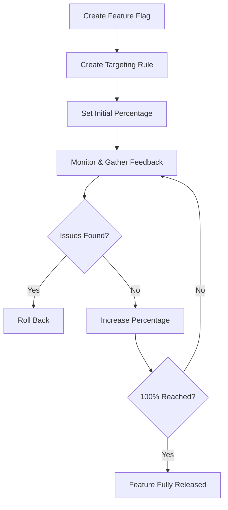
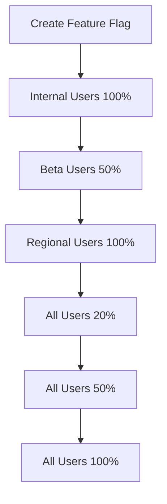

# Gradual Rollouts

Gradual rollouts are a key feature flag pattern that allows you to release new features to users incrementally, reducing risk and enabling quick rollbacks if issues arise.

## What is a Gradual Rollout?

A gradual rollout is the process of releasing a feature to a small percentage of users first, then incrementally increasing the percentage until the feature is available to everyone. This approach:

- Reduces risk by limiting the impact of bugs
- Allows for monitoring system health during rollout
- Enables gathering user feedback early
- Provides ability to roll back quickly if issues arise

## Implementing Gradual Rollouts with easyFlags

easyFlags makes implementing gradual rollouts straightforward through its percentage rollout capability in targeting rules.

### Basic Gradual Rollout Pattern



### Step-by-Step Implementation

1. **Create a Feature Flag**

   Start by creating a feature flag for the new functionality:

   ```javascript
   const response = await fetch('https://api.easyflags.example.com/feature-flags', {
     method: 'POST',
     headers: {
       'Content-Type': 'application/json',
       'Authorization': 'Bearer YOUR_ACCESS_TOKEN',
       'x-tenant-id': 'YOUR_TENANT_ID'
     },
     body: JSON.stringify({
       name: 'New Search Algorithm',
       key: 'new-search-algorithm',
       description: 'Enables the new search algorithm with improved relevance',
       enabled: true
     })
   });
   ```

2. **Create a Targeting Rule with Initial Percentage**

   Create a targeting rule that applies to all users but with a small initial percentage:

   ```javascript
   const response = await fetch(`https://api.easyflags.example.com/feature-flags/${flagId}/targeting-rules`, {
     method: 'POST',
     headers: {
       'Content-Type': 'application/json',
       'Authorization': 'Bearer YOUR_ACCESS_TOKEN',
       'x-tenant-id': 'YOUR_TENANT_ID'
     },
     body: JSON.stringify({
       name: 'Gradual Rollout',
       description: 'Percentage-based rollout for all users',
       percentage: 5, // Start with just 5% of users
       enabled: true,
       conditions: [] // Empty array means this applies to all users
     })
   });
   ```

3. **Monitor the Feature**

   Monitor metrics, error rates, and user feedback for users with the feature enabled.

4. **Incrementally Increase the Percentage**

   As confidence grows, gradually increase the percentage:

   ```javascript
   const response = await fetch(`https://api.easyflags.example.com/feature-flags/${flagId}/targeting-rules/${ruleId}`, {
     method: 'PATCH',
     headers: {
       'Content-Type': 'application/json',
       'Authorization': 'Bearer YOUR_ACCESS_TOKEN',
       'x-tenant-id': 'YOUR_TENANT_ID'
     },
     body: JSON.stringify({
       percentage: 20 // Increase to 20%
     })
   });
   ```

5. **Repeat Until Full Rollout**

   Continue increasing the percentage (20% → 50% → 100%) as confidence grows.

## Advanced Gradual Rollout Strategies

### Phased Rollout

A more sophisticated approach is to roll out to specific user groups in phases:



#### Implementation:

1. **Internal Users First**

   ```javascript
   // Rule for internal employees (100%)
   await createRule({
     name: 'Internal Users',
     conditions: [{ attribute: 'email', operator: 'ENDS_WITH', value: '@ourcompany.com' }],
     percentage: 100
   });
   ```

2. **Beta Program Users**

   ```javascript
   // Rule for beta users (50%)
   await createRule({
     name: 'Beta Users',
     conditions: [{ attribute: 'userGroup', operator: 'EQUALS', value: 'beta' }],
     percentage: 50
   });
   ```

3. **Regional Rollout**

   ```javascript
   // Rule for specific regions (100%)
   await createRule({
     name: 'US Region',
     conditions: [{ attribute: 'location.country', operator: 'EQUALS', value: 'US' }],
     percentage: 100
   });
   ```

4. **Global Gradual Rollout**

   ```javascript
   // Default rule for all other users (start at 20%)
   await createRule({
     name: 'Global Rollout',
     conditions: [],
     percentage: 20
   });
   ```

### Ring Deployment Model

A "ring deployment" model gradually expands the audience in concentric circles:

```
┌───────────────────────────────────────┐
│ Production - All Users (Ring 4)       │
│ ┌───────────────────────────────────┐ │
│ │ Early Adopters (Ring 3)           │ │
│ │ ┌───────────────────────────────┐ │ │
│ │ │ Beta Users (Ring 2)           │ │ │
│ │ │ ┌───────────────────────────┐ │ │ │
│ │ │ │ Internal Users (Ring 1)   │ │ │ │
│ │ │ └───────────────────────────┘ │ │ │
│ │ └───────────────────────────────┘ │ │
│ └───────────────────────────────────┘ │
└───────────────────────────────────────┘
```

## Best Practices for Gradual Rollouts

1. **Start small**: Begin with 1-5% of users to minimize impact of potential issues

2. **Use consistent user bucketing**: easyFlags ensures users consistently get the same experience by using deterministic hashing for the percentage calculation

3. **Define clear rollout stages**: Create a rollout plan with specific percentage targets and timeframes

4. **Monitor key metrics**: Track error rates, performance metrics, and user feedback at each stage

5. **Have a rollback plan**: Be prepared to disable the feature flag quickly if issues arise

6. **Consider user segmentation**: Roll out to less critical segments first (internal users, beta testers)

7. **Communicate with stakeholders**: Keep everyone informed about the rollout progress

8. **Automate when possible**: Use scheduled flag changes for automatic percentage increases:

   ```javascript
   await fetch(`https://api.easyflags.example.com/feature-flags/${flagId}/scheduled-changes`, {
     method: 'POST',
     headers: {
       'Content-Type': 'application/json',
       'Authorization': 'Bearer YOUR_ACCESS_TOKEN'
     },
     body: JSON.stringify({
       scheduledTime: '2023-06-15T14:00:00Z',
       changes: {
         ruleId: 'r8c3de3d-1fea-4d7c-a8b0-29f63c4c3454',
         percentage: 50
       }
     })
   });
   ```

## Gradual Rollout Checklist

- [ ] Feature flag created and enabled
- [ ] Initial targeting rule with small percentage (1-5%) created
- [ ] Monitoring set up for key metrics
- [ ] Rollout plan with percentage targets and timeline defined
- [ ] Rollback plan documented
- [ ] Communication plan established
- [ ] Success criteria defined

## Common Challenges and Solutions

| Challenge | Solution |
|-----------|----------|
| Inconsistent user experience | Use persistent user IDs for percentage calculations |
| Monitoring only new code path | Track metrics for both old and new code paths |
| Manual percentage updates | Use scheduled changes for automated rollouts |
| Stuck at partial rollout | Set a target date for 100% rollout or feature decision |
| Percentage calculations seem random | Ensure using consistent hashing (easyFlags handles this automatically) |

## Conclusion

Gradual rollouts are a powerful pattern for reducing risk and ensuring smooth feature releases. easyFlags makes this process straightforward with its percentage-based targeting rules and consistent user bucketing. By following the best practices outlined in this guide, you can confidently release new features to your users with minimal risk. 