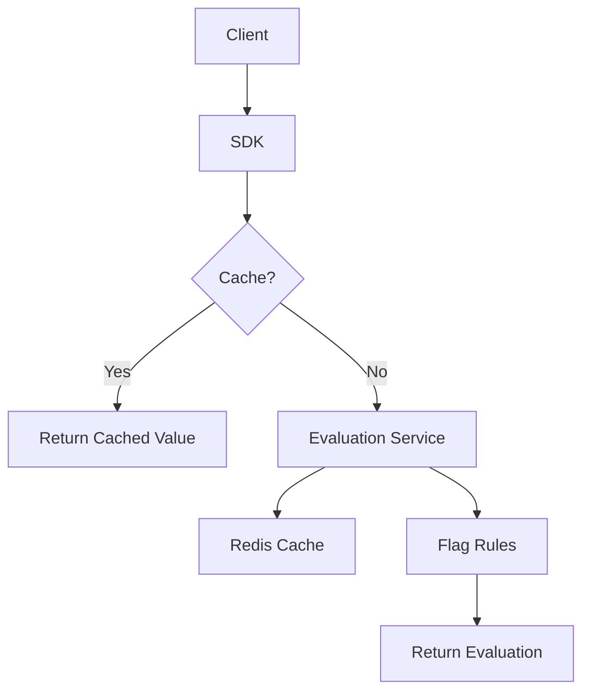

# easyFlags

High-performance feature flag management with sub-10ms evaluation times.

## Ultra-Fast Feature Flag Management

easyFlags is a high-performance feature flag service with sub-10ms evaluation times, perfect for mission-critical applications where latency matters.

<div class="grid cards" markdown>

- :rocket: **High Performance**  
  Sub-10ms evaluation times with multi-level caching

- :globe_with_meridians: **Multi-Tenant**  
  Secure isolation for teams and organizations

- :material-flag-variant: **Advanced Targeting**  
  Sophisticated rules with percentage rollouts

- :material-lightning-bolt: **Real-Time Updates**  
  Instant flag changes via WebSockets

</div>

## Get Started in Minutes

```bash
# Install the JavaScript SDK
npm install @easyflags/sdk-js

# Initialize the client
const client = new FeatureFlagClient({
  apiUrl: 'https://api.easyflags.example.com',
  apiKey: 'your-api-key'
});

# Check if a feature is enabled
const isEnabled = await client.getBooleanValue('new-feature', false, {
  userId: 'user-123',
  userRole: 'premium'
});
```

## How It Works



## Designed for High-Scale Applications

easyFlags is built to handle millions of evaluations per second with consistent low-latency responses, making it ideal for applications where performance is critical.

[Get Started :material-arrow-right:](getting-started/index.md){ .md-button .md-button--primary }
[View on GitHub :fontawesome-brands-github:](https://github.com/yourname/easyFlags){ .md-button } 