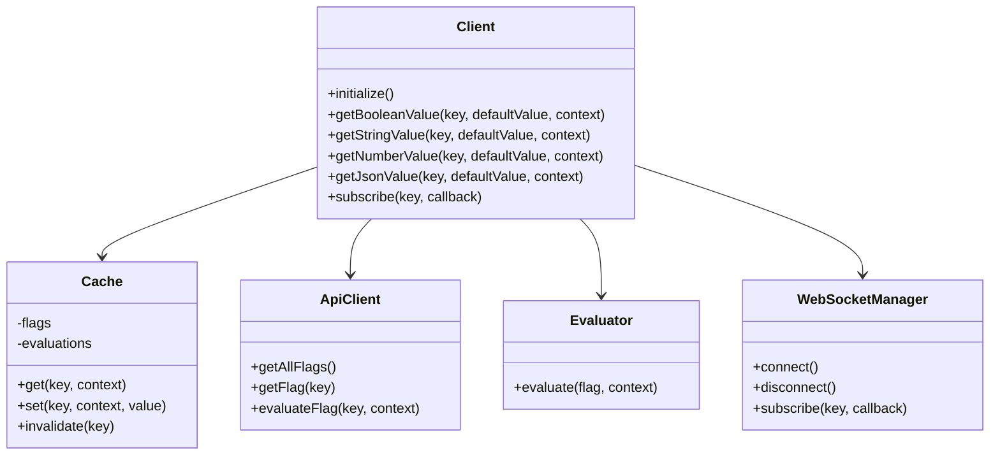

# SDK Integration

easyFlags provides Software Development Kits (SDKs) for multiple languages and frameworks to make integrating feature flags into your applications as seamless as possible.

## Available SDKs

easyFlags provides the following SDKs:

| SDK | Platform | Status | Documentation |
|-----|----------|--------|---------------|
| JavaScript | Browser, Node.js | Stable | [JavaScript SDK](javascript.md) |
| React | Browser | Stable | [React SDK](react.md) |
| Node.js | Server | Stable | [Node.js SDK](nodejs.md) |
| Python | Server | Beta | [Python SDK](python.md) |
| Java | Server | Beta | Coming soon |
| Go | Server | Beta | Coming soon |
| .NET | Server | Planning | Coming soon |
| Ruby | Server | Planning | Coming soon |

## Core Concepts

All SDKs follow similar patterns and concepts, making it easy to use easyFlags across your technology stack.

### Client Initialization

Each SDK provides a client that needs to be initialized with your API key and configuration:

```javascript
// JavaScript example
const client = new FeatureFlagClient({
  apiUrl: 'https://api.easyflags.example.com',
  apiKey: 'your-api-key',
  tenantId: 'your-tenant-id' // Optional for multi-tenant setups
});

await client.initialize(); // Load flag configurations
```

### Flag Evaluation

SDKs provide methods to check if a feature is enabled:

```javascript
// Check boolean flag
const isEnabled = await client.getBooleanValue(
  'new-feature',   // Flag key
  false,           // Default value
  { userId: '123' } // Context
);

// Get string variation
const theme = await client.getStringValue(
  'theme',        // Flag key
  'default',      // Default value 
  { userId: '123' } // Context
);
```

### Evaluation Context

The context object contains information about the current user and environment that determines which variation they should receive:

```javascript
const context = {
  userId: 'user-123',            // Unique user identifier
  userRole: 'premium',           // User role or permissions
  location: {                    // Nested attributes
    country: 'US',
    region: 'West'
  },
  deviceType: 'mobile',          // Device information
  appVersion: '2.1.0'            // Application version
};
```

### Caching

SDKs implement multi-level caching to ensure optimal performance:

1. **In-memory cache**: For ultra-fast lookups (sub-millisecond)
2. **Local storage**: For persistence across page reloads (browser SDKs)
3. **Background synchronization**: To keep flags up-to-date

### Real-time Updates

All SDKs support real-time updates via WebSockets:

```javascript
// Subscribe to changes for a specific flag
const unsubscribe = client.subscribe('new-feature', (newValue) => {
  console.log('Feature flag changed:', newValue);
  // Update UI or application state
});

// Later, unsubscribe when no longer needed
unsubscribe();
```

## SDK Architecture



## SDK Best Practices

### 1. Initialize Early

Initialize the SDK as early as possible in your application lifecycle to preload flag data:

```javascript
// React example
function App() {
  const [isInitialized, setIsInitialized] = useState(false);
  
  useEffect(() => {
    // Initialize on app start
    client.initialize()
      .then(() => setIsInitialized(true))
      .catch(err => console.error('Failed to initialize flags', err));
  }, []);
  
  if (!isInitialized) {
    return <LoadingIndicator />;
  }
  
  return <YourApp />;
}
```

### 2. Reuse Context Objects

Create context objects once and reuse them for multiple flag checks to improve performance:

```javascript
// Create context once
const context = {
  userId: user.id,
  userRole: user.role,
  location: user.location
};

// Use for multiple evaluations
const isFeatureAEnabled = await client.getBooleanValue('feature-a', false, context);
const isFeatureBEnabled = await client.getBooleanValue('feature-b', false, context);
```

### 3. Handle Default Values Properly

Always provide sensible default values that will be used if:

- The SDK hasn't initialized yet
- The network request fails
- The flag doesn't exist
- An error occurs during evaluation

```javascript
// Provide meaningful defaults
const theme = await client.getStringValue('theme', 'light', context);
const maxItems = await client.getNumberValue('max-items', 10, context);
```

### 4. Clean Up Subscriptions

When using the subscription API, always clean up subscriptions when components unmount:

```javascript
// React example
useEffect(() => {
  // Subscribe to changes
  const unsubscribe = client.subscribe('feature', (value) => {
    setFeatureEnabled(value);
  });
  
  // Clean up on unmount
  return () => unsubscribe();
}, []);
```

### 5. Use Type-Specific Methods

Use the appropriate type-specific methods for different flag types:

```javascript
// Boolean flags
const isEnabled = await client.getBooleanValue('feature', false, context);

// String flags
const theme = await client.getStringValue('theme', 'light', context);

// Number flags
const limit = await client.getNumberValue('limit', 10, context);

// JSON flags
const config = await client.getJsonValue('config', { timeout: 1000 }, context);
```

## Offline Support

easyFlags SDKs provide offline support through local caching:

```javascript
// Initialize with offline support enabled
const client = new FeatureFlagClient({
  apiUrl: 'https://api.easyflags.example.com',
  apiKey: 'your-api-key',
  offlineSupport: true, // Enable offline support
  cacheOptions: {
    persistToLocalStorage: true, // Enable local storage
    ttl: 3600000 // Cache TTL in milliseconds (1 hour)
  }
});

// Initialize once online
await client.initialize();

// Later, even if offline, flags can still be evaluated
const isEnabled = await client.getBooleanValue('feature', false, context);
```

## Next Steps

Choose your platform-specific SDK documentation to get started:

- [JavaScript SDK](javascript.md) - For browser and Node.js applications
- [React SDK](react.md) - For React applications
- [Node.js SDK](nodejs.md) - Optimized for server-side Node.js applications
- [Python SDK](python.md) - For Python applications
