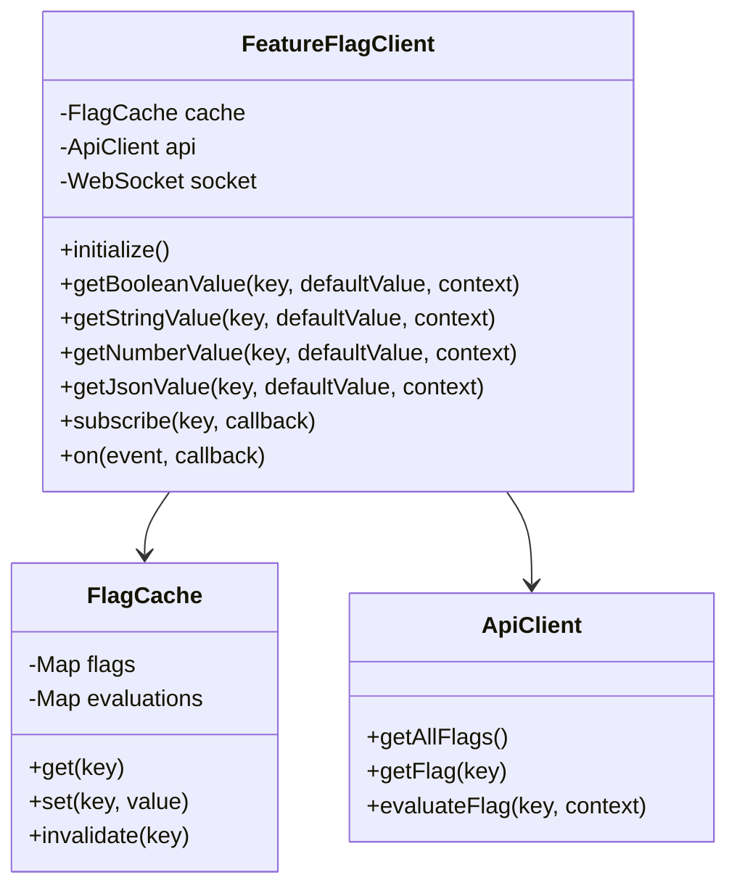

# JavaScript SDK

The easyFlags JavaScript SDK provides a client-side implementation for evaluating feature flags in browser and Node.js environments.

## Installation

=== "npm"

    ```bash
    npm install @easyflags/sdk-js
    ```

=== "yarn"

    ```bash
    yarn add @easyflags/sdk-js
    ```

=== "pnpm"

    ```bash
    pnpm add @easyflags/sdk-js
    ```

## Initialization

```javascript
import { FeatureFlagClient } from '@easyflags/sdk-js';

// Initialize the client
const client = new FeatureFlagClient({
  apiUrl: 'https://api.easyflags.example.com',
  apiKey: 'your-api-key',
  tenantId: 'your-tenant-id', // Optional, for multi-tenant installations
  streaming: true, // Enable WebSocket for real-time updates (default: true)
  cacheOptions: {
    persistToLocalStorage: true, // Enable local storage caching (default: true)
    ttl: 60000 // Cache TTL in milliseconds (default: 60000)
  }
});

// Initialize the client by fetching flags
await client.initialize();
```

## Basic Usage

### Boolean Flags

```javascript
// Check if a feature is enabled
const isEnabled = await client.getBooleanValue(
  'new-feature', // Flag key
  false,         // Default value if flag not found
  {              // Context object for evaluation
    userId: 'user-123',
    userRole: 'premium',
    location: {
      country: 'US'
    }
  }
);

if (isEnabled) {
  // Feature is enabled
} else {
  // Feature is disabled
}
```

### String Flags

```javascript
// Get string variation
const theme = await client.getStringValue(
  'theme',
  'default',
  { userId: 'user-123' }
);

// Use the theme value
document.body.className = theme;
```

### Number Flags

```javascript
// Get number variation
const maxItems = await client.getNumberValue(
  'max-items-per-page',
  10,
  { userId: 'user-123' }
);

// Use the number value
fetchItems({ limit: maxItems });
```

### JSON Flags

```javascript
// Get JSON variation
const config = await client.getJsonValue(
  'feature-config',
  { enabled: false, maxRetries: 3 },
  { userId: 'user-123' }
);

// Use the configuration
setupFeature(config);
```

## Subscribing to Flag Changes

The SDK supports real-time updates via WebSockets. You can subscribe to flag changes:

```javascript
// Subscribe to a flag
const unsubscribe = client.subscribe('new-feature', (value) => {
  console.log('Flag value changed:', value);
  // Update your UI or application state
});

// Later, unsubscribe when no longer needed
unsubscribe();
```

## Batch Evaluation

For optimized performance, you can evaluate multiple flags at once:

```javascript
// Evaluate multiple flags
const results = await client.batchEvaluate(
  ['new-feature', 'another-feature', 'third-feature'],
  { userId: 'user-123', userRole: 'premium' }
);

// Use the results
if (results['new-feature']) {
  // New feature is enabled
}

if (results['another-feature']) {
  // Another feature is enabled
}
```

## Error Handling

```javascript
try {
  const isEnabled = await client.getBooleanValue('new-feature', false, context);
  // Use the flag value
} catch (error) {
  console.error('Failed to evaluate flag:', error);
  // Fall back to default behavior
}
```

## Performance Optimization

### Reusing Context

To optimize performance, reuse the same context object for multiple evaluations:

```javascript
// Create a context once
const context = {
  userId: user.id,
  userRole: user.role,
  location: {
    country: user.country
  }
};

// Use it for multiple evaluations
const isFeatureAEnabled = await client.getBooleanValue('feature-a', false, context);
const isFeatureBEnabled = await client.getBooleanValue('feature-b', false, context);
```

### Pre-fetching Flags

For optimal performance, initialize the client early in your application lifecycle to pre-fetch flags:

```javascript
// During app initialization
await client.initialize();

// Later when flags are needed, they'll already be cached
const isEnabled = await client.getBooleanValue('new-feature', false, context);
```

## Offline Support

The SDK supports offline mode through local storage caching:

```javascript
// Configure offline support
const client = new FeatureFlagClient({
  apiUrl: 'https://api.easyflags.example.com',
  apiKey: 'your-api-key',
  cacheOptions: {
    persistToLocalStorage: true,
    ttl: 3600000 // 1 hour
  }
});

// Initialize once online
await client.initialize();

// Later, even if offline, flags can still be evaluated
const isEnabled = await client.getBooleanValue('new-feature', false, context);
```

## Advanced Configuration

### Custom Cache Keys

```javascript
const client = new FeatureFlagClient({
  // ... other options
  cacheOptions: {
    generateCacheKey: (flagKey, context) => {
      // Custom cache key generation logic
      return `${flagKey}:${context.userId || 'anonymous'}`;
    }
  }
});
```

### Event Handling

```javascript
// Listen to evaluation events
client.on('evaluation', (event) => {
  console.log('Flag evaluated:', event.key, 'Result:', event.value);
});

// Listen to error events
client.on('error', (error) => {
  console.error('SDK error:', error);
});

// Listen to ready event
client.on('ready', () => {
  console.log('SDK is ready to use');
});
```

## SDK Architecture



## Full Example

```javascript
import { FeatureFlagClient } from '@easyflags/sdk-js';

// Initialize client
const client = new FeatureFlagClient({
  apiUrl: 'https://api.easyflags.example.com',
  apiKey: 'your-api-key',
  streaming: true,
  cacheOptions: {
    persistToLocalStorage: true
  }
});

// Wait for initialization
await client.initialize();

// Common context
const context = {
  userId: 'user-123',
  userRole: 'premium',
  location: {
    country: 'US',
    region: 'West'
  },
  deviceType: 'mobile'
};

// Evaluate different flag types
const isNewFeatureEnabled = await client.getBooleanValue('new-feature', false, context);
const uiTheme = await client.getStringValue('ui-theme', 'light', context);
const maxItems = await client.getNumberValue('max-items', 10, context);
const apiConfig = await client.getJsonValue('api-config', { timeout: 3000 }, context);

// Subscribe to changes
const unsubscribe = client.subscribe('new-feature', (newValue) => {
  console.log('Feature flag changed:', newValue);
  updateUI(newValue);
});

// Listen to events
client.on('error', (error) => {
  console.error('SDK error:', error);
});

// Clean up when done
function cleanup() {
  unsubscribe();
}
``` 