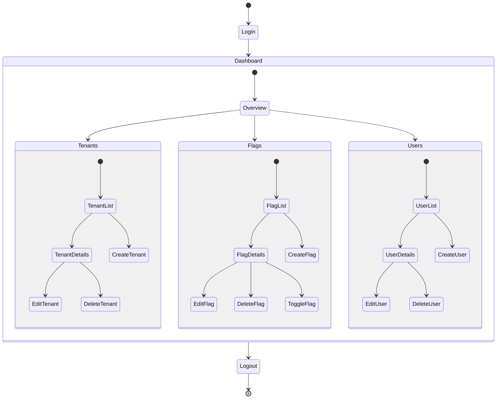

# Admin UI Workflow

This state diagram illustrates the administrative user interface workflow for managing feature flags, tenants, and users.

## Admin UI Key Sections

### Dashboard Overview
- System-wide metrics and statistics
- Recent activity log
- Tenant health indicators
- Quick access to common operations

### Tenant Management
- List all tenants with search and filter capabilities
- Create new tenants with template options
- Edit tenant settings and metadata
- Delete tenants (with safety confirmations)
- Manage tenant-specific API keys

### Feature Flag Management
- List all flags with status indicators and search
- Create new feature flags with various types (boolean, string, number, JSON)
- Edit flag rules and targeting conditions
- Toggle flags on/off with one click
- View flag evaluation history and metrics

### User Management
- List all users with search and filter
- Create new users with specific roles
- Edit user permissions and roles
- Delete users
- Cross-tenant user administration (for super admins) 