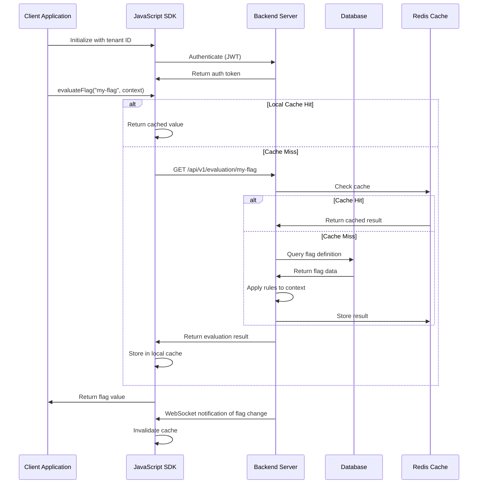

# Feature Flag Evaluation Flow

This sequence diagram illustrates the process of evaluating a feature flag, from client request through the SDK to the backend service.

## Evaluation Process Details

1. **SDK Initialization**: The client initializes the SDK with tenant ID and optional configuration
2. **Authentication**: The SDK authenticates with the backend to obtain a valid token
3. **Local Caching**: SDKs maintain a local cache to minimize network requests 
4. **Context-based Evaluation**: Flag values can vary based on user context (user ID, attributes, etc.)
5. **Multi-level Caching**: The system uses both client-side and server-side caching
6. **Real-time Updates**: WebSocket connections notify clients when flag configurations change
7. **Fallback Values**: SDKs provide default values in case of network failures 