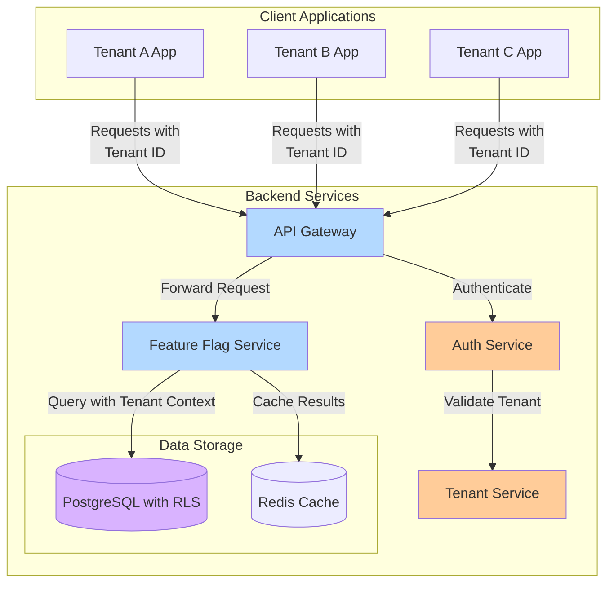

# Multi-Tenant Architecture

This diagram shows how the feature flag service handles multiple tenants, ensuring proper isolation and security between different clients.

## Multi-Tenant Implementation Details

- **Tenant Identification**: Each request includes a tenant identifier (either in headers, JWT token, or URL)
- **Row-Level Security (RLS)**: Database-level isolation ensures tenants can only access their own data
- **Tenant Middleware**: NestJS middleware validates and enforces tenant context on all requests
- **Isolated Caching**: Cache keys include tenant identifiers to prevent cross-tenant data leakage
- **Cross-Tenant Administration**: Admin users with special permissions can manage multiple tenants 