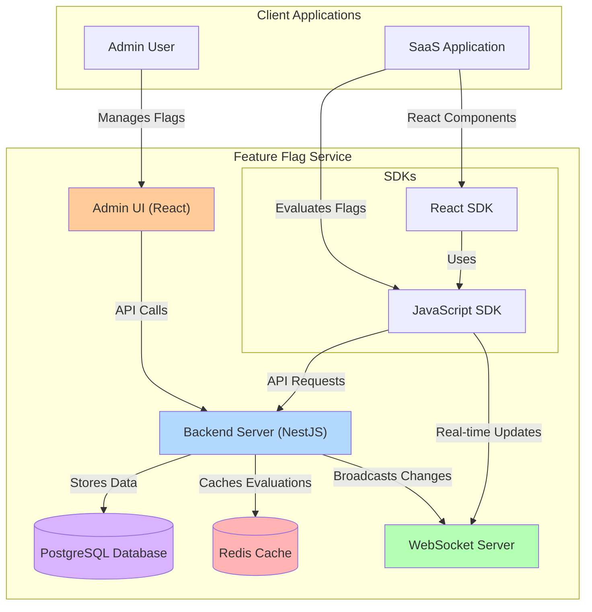

# System Overview

This diagram illustrates the high-level architecture of the feature flag service, showing the main components and their interactions.

## Key Components

- **Backend Server (NestJS)**: Core service that handles all feature flag logic
- **Admin UI (React)**: Web interface for managing feature flags and tenants
- **PostgreSQL Database**: Persistent storage for all feature flags and tenant data
- **Redis Cache**: High-performance cache for flag evaluations
- **WebSocket Server**: Enables real-time updates when flag configurations change
- **SDKs**: Client libraries for JavaScript and React applications to consume the service 