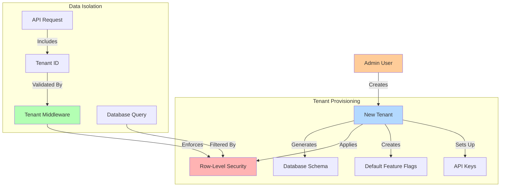

# Tenant Provisioning and Isolation

This diagram illustrates how new tenants are provisioned and how data isolation is maintained between tenants.

## Tenant Provisioning Process

1. **Tenant Creation**: Admin users can create new tenants through the Admin UI or API
2. **Database Isolation**: Each tenant's data is isolated using PostgreSQL Row-Level Security policies
3. **Default Setup**: New tenants are initialized with a set of default feature flags
4. **API Key Generation**: Each tenant receives unique API keys for authentication
5. **Permission Setup**: Default roles and permissions are established for the tenant

## Data Isolation Mechanisms

1. **Request Context**: Every API request must include a tenant identifier
2. **Middleware Validation**: NestJS middleware validates the tenant context on each request
3. **RLS Policies**: Database queries automatically filter data by tenant ID
4. **Cache Isolation**: Redis cache keys include tenant identifiers
5. **Cross-tenant Operations**: Special admin permissions are required for cross-tenant operations 